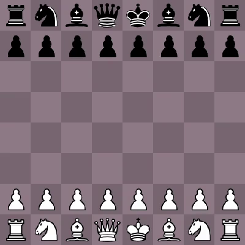

# chessview
Viewer and player for chess games and bots using SDL2. Still very WIP.

## Available bots
* **Random**: Plays a random move from the set of available moves. Makes for interesting but silly games.
* **WhiteSquares**: Ranks moves according to how many pieces fall onto white squares and prefers these. Leads to interesting aesthetic patterns.
* **BlackSquares**: Like WhiteSqaures, but for black squares (obviously).
* **MinimizeOpponentMoves**: Makes plays in order to minimize the number of counter moves the opponent has. Is actually quite decent at chess, since usually ends up checkmating.
* **Defensive**: Plays in order to minimize the number of its own pieces being captured and under attack.
* **Offensive**: Plays in order to maximize the number of opponent pieces being captured and under attack.
* **Suicidal**: Opposite of Defensive; plays in order to maximize the number of its own pieces being captures and under attack.
* **Pacifist**: Opposite of Offensive; plays in order to minimize the number of opponent pieces being captured and under attack.

## Features
* Generates all legal moves for all pieces, allowing bots to rank them.
* Supports checkmate and most stalemate conditions (0 moves but not in check, 50 stale moves, and insufficient material).
* Ability to easily write your own bots. (Hopefully.)

## Planned
* Many more dumb but interesting bots.
* [Castling](https://en.wikipedia.org/wiki/Castling) and [en passant](https://en.wikipedia.org/wiki/En_passant) as available legal moves.
* Pawn promotion. Pawns currently automatically promote to Queens.
* Threefold repetition stalemate [rule](https://en.wikipedia.org/wiki/Threefold_repetition).
* Support for PGN string imports (to watch existing games).
* Player interaction (e.g. player vs. bot).
* Ability to specify which bots to play on the command line.
* Competition between bots.
* Recording of games to files (probably in PGN notation).

## Unplanned
* Good players.

## Inspiration
* This project is heavily inspired by Tom7's [30 weird chess algorithms](https://www.youtube.com/watch?v=DpXy041BIlA) video, which I highly suggest you watch. This project is in early stages, but I hope to make some more similarly interesting bots and puzzles.