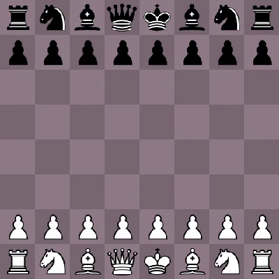
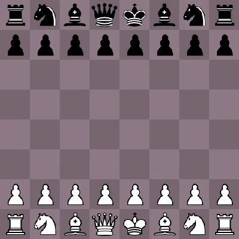
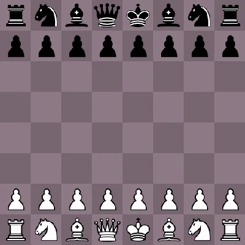

# chessview
Viewer and player for chess games and bots using SDL2. Still very WIP.

## Examples with Bots

### Suicidal vs. Offensive
Here, white continuously offers up its pieces for capture, and black gladly accepts.

### WhiteSquares vs. BlackSquares
White tries to put its pieces on white squares, and black squares for Black, creating some aesthetic patterns.

### Centre vs ClearPath
White tries to move its pieces as close to the centre as possible; black tries to move them to the edges. Both players succeed in completely missing the point of chess.

---

## Usage 

### Command line 
To run a game, specify which bots to play for both white and black sides:
<pre>chess [white] [black]</pre>
(Possible players are described below.)

### Controls 
* **Space**: Play/pause the playback.
* **Left**: When paused, steps backwards through the moves.
* **Right**: When paused, steps forwards through moves. If user has undone some moves, this will playback the same moves; otherwise, new moves are selected from the players as normal.

### Players

* `random`: Plays a random move from the set of available moves. Makes for interesting but silly games.
* `whitesquares`: Ranks moves according to how many pieces fall onto white squares and prefers these. Leads to interesting aesthetic patterns.
* `blacksquares`: Like `whitesquares`, but for black squares (obviously).
* `minimize`: Makes plays in order to minimize the number of counter moves the opponent has. Is actually quite decent at chess, since usually ends up checkmating.
* `defensive`: Plays in order to minimize the number of its own pieces being captured and under attack.
* `offensive`: Plays in order to maximize the number of opponent pieces being captured and under attack.
* `suicidal`: Opposite of `defensive`; plays in order to maximize the number of its own pieces being captures and under attack.
* `pacifist`: Opposite of `offensive`; plays in order to minimize the number of opponent pieces being captured and under attack.
* `centre`: Plays in order to control the centre d and e files.
* `clearpath`: Opposite of `centre`; plays to control the a and h files.
* `aggressive`: Plays to push its pieces to the opposite rank. Pushes one piece and then keeps moving that piece back and forth. Quite boring.
* `passive`: Plays to prevent pushing its pieces at all; insanely boring (and terrible.)

## Features
* Generates all legal moves for all pieces, allowing bots to rank them.
* Supports checkmate and most stalemate conditions (0 moves but not in check, 50 stale moves, and insufficient material).
* Ability to easily write your own bots. (Hopefully.)

## Planned
* Many more dumb but interesting bots.
* [Castling](https://en.wikipedia.org/wiki/Castling) and [en passant](https://en.wikipedia.org/wiki/En_passant) as available legal moves.
* ~~Pawn promotion. Pawns currently automatically promote to Queens.~~
* Threefold repetition stalemate [rule](https://en.wikipedia.org/wiki/Threefold_repetition).
* Support for PGN string imports (to watch existing games).
* Player interaction (e.g. player vs. bot).
* ~~Ability to specify which bots to play on the command line.~~
* Competition between bots.
* Recording of games to files (probably in PGN notation).

## Unplanned
* Good players.

## Inspiration
* This project is heavily inspired by Tom7's [30 weird chess algorithms](https://www.youtube.com/watch?v=DpXy041BIlA) video, which I highly suggest you watch. This project is in early stages, but I hope to make some more similarly interesting bots and puzzles.